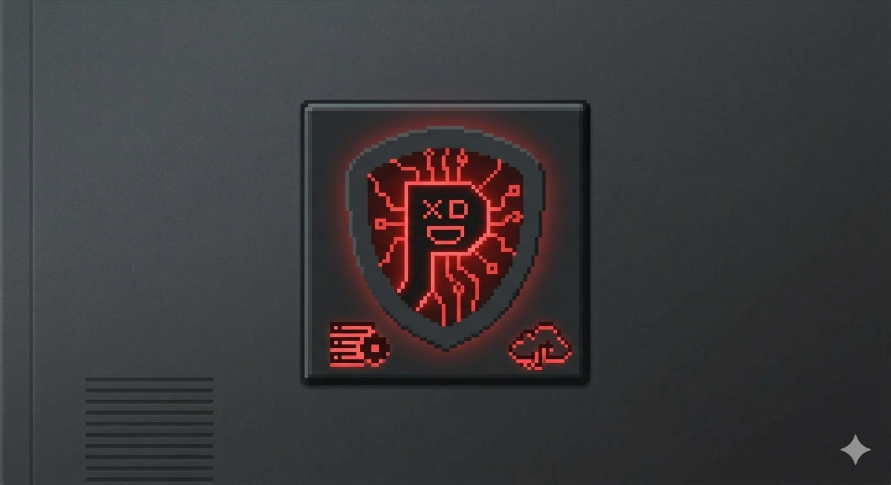

<p align="center">
  
</p>

<h1 align="center">PortMortem</h1>
<p align="center">
  <b>Network vulnerability scanner powered by Nmap and the National Vulnerability Database.</b><br/>
  <sub>Scan. Detect. Score. Report.</sub>
</p>

<p align="center">
  
  
  
  
  
</p>

---

## What it does

PortMortem scans a target machine or network, fingerprints the services running on open ports, and checks each one against known CVEs from the NVD. The result is a prioritized risk report — instead of raw Nmap output, you get a clear picture of what's exposed and how dangerous it actually is.

---

## Features

- Auto-detects your local gateway IP on launch
- Nmap `-sV` scan to detect open ports and service versions
- Live CVE lookups via NVD REST API v2.0
- CVSS v3 risk scoring per service and overall
- Dark terminal-style GUI built with Tkinter
  - Segmented pulse bar that fills and color-shifts with scan severity
  - Live scrolling scan log with color-coded severity output
  - Expandable results tree — click any row to see individual CVEs
  - Clickable CVE IDs — opens the NVD detail page in your browser
  - Scan history dropdown — retains the last 5 scans with full log and results
  - Per-scan HTML export from both current scan and history
- Standalone HTML report with clickable CVE links

---

## Stack

| Tool | Purpose |
|------|---------|
| Python 3.10+ | Core language |
| Nmap | Scanning engine |
| python-nmap | Python wrapper for Nmap |
| NVD REST API v2.0 | CVE + CVSS data |
| Tkinter | Desktop GUI |
| Rich | Terminal output formatting |
| Requests | HTTP calls |

---

## Project layout

```
portmortem/
├── main.py          # CLI entry point
├── gui.py           # Tkinter GUI entry point
├── scanner.py       # Nmap wrapper + parser
├── nvd_client.py    # NVD API integration
├── scorer.py        # CVSS risk scoring logic
├── reporter.py      # HTML report generator
├── assets/
│   └── logo.png     # Project logo
├── reports/         # Generated HTML reports (git-ignored)
├── requirements.txt
├── .env             # NVD_API_KEY (git-ignored)
└── .gitignore
```

---

## Setup

**Prerequisites:** Python 3.10+, Nmap, a free NVD API key.

Get an NVD API key: https://nvd.nist.gov/developers/request-an-api-key

```bash
# Install Nmap (Kali has it by default)
sudo apt install nmap

# Install Python dependencies
pip install -r requirements.txt

# Add your NVD API key
echo "NVD_API_KEY=your_key_here" > .env
```

---

## Usage

**GUI (recommended):**
```bash
sudo python3 gui.py
```

**CLI:**
```bash
sudo python3 main.py --target 192.168.1.1
sudo python3 main.py --target 192.168.1.0/24 --report
```

---

## Scoring

CVSS v3 base scores from the NVD:

| Score | Label |
|-------|-------|
| 9.0 – 10.0 | Critical |
| 7.0 – 8.9  | High |
| 4.0 – 6.9  | Medium |
| 0.1 – 3.9  | Low |

The overall score is a weighted average of the top CVEs found across all scanned services.

---

## Disclaimer

Only scan systems you own or have explicit permission to test. Unauthorized scanning is illegal in most jurisdictions. This tool is for educational and authorized use only.

---

## Roadmap

- [x] Nmap scanning + version detection
- [x] NVD CVE lookup
- [x] CVSS risk scoring
- [x] CLI report + HTML export
- [x] Tkinter GUI with live scan log
- [x] Segmented pulse bar indicator
- [x] Scan history with dropdown navigation
- [x] Clickable CVE IDs → NVD browser
- [x] Auto gateway detection
- [ ] JSON export
- [ ] Scan diff — detect changes between runs
- [ ] Email report delivery
- [ ] Web dashboard

---

## Author

[Your Name] — built as a student project exploring network security and vulnerability assessment.